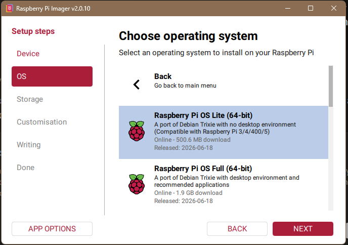
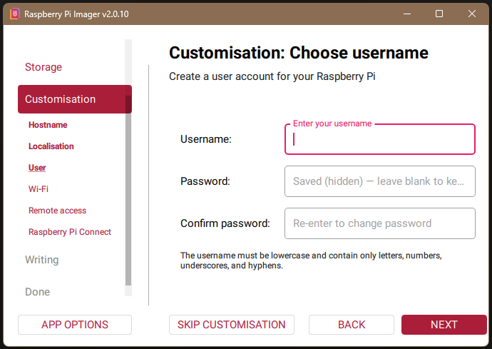
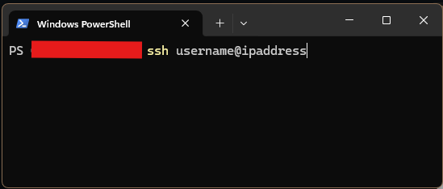
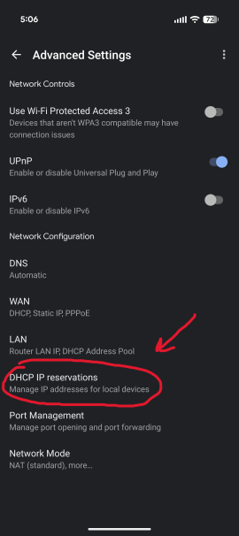
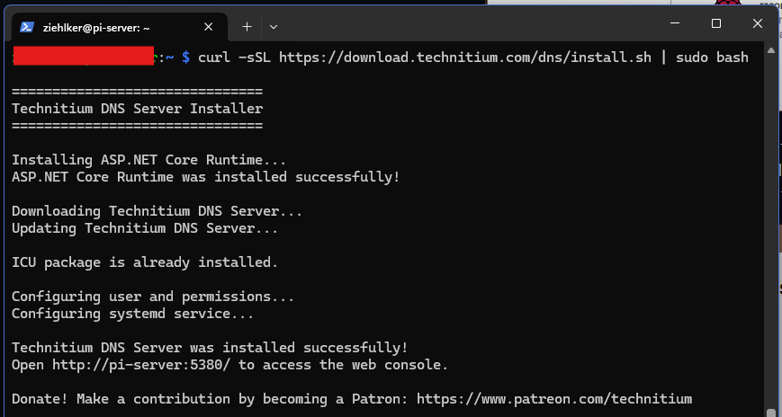
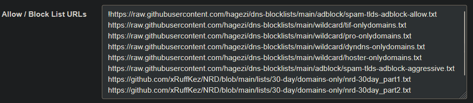
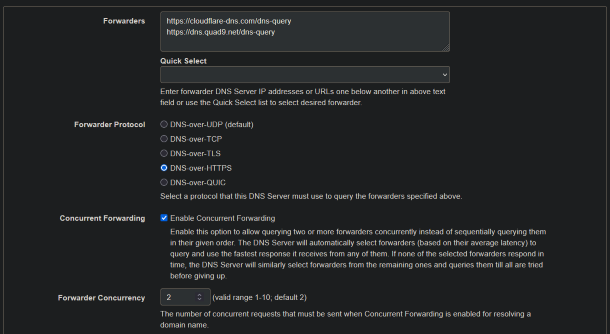
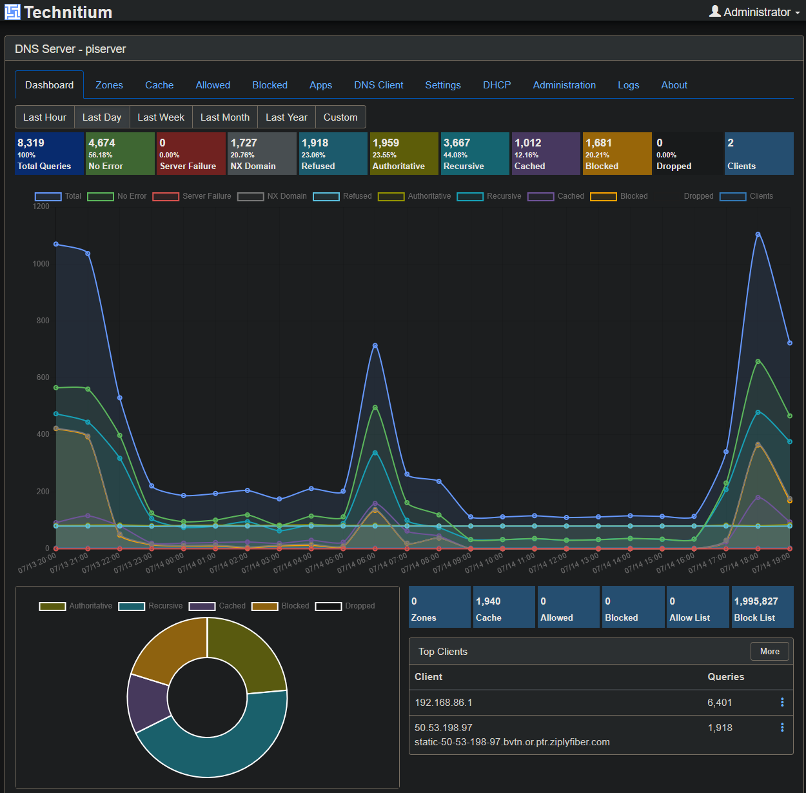

# DNS Sinkhole on Raspberry Pi 5 (Technitium DNS)
Network-wide ad and malware domain blocking using Technitium DNS Server as a sinkhole on a Raspberry Pi 5.

## Overview
Blocks malware, ads, and trackers across entire home network, on every device. Block lists update automatically.

## Hardware & Software
- Raspberry Pi 5
- Windows 11 PC for imaging and remote control of Pi server
- Technitium DNS Server

## Setup
Step 1: Download 'Raspberry Pi Imager' on your Windows desktop from raspberrypi.com/software. Insert your microSD card (or USB SSD). Choose Raspberry Pi 5 as the device, 'Raspberry Pi OS (other)' > 'Raspberry Pi OS Lite (64-bit)' as the OS since you don't need a desktop for a headless server, and your card as storage.

Step 2: When Imager asks 'Would you like to apply OS customisation settings?', click Edit Settings. Set a hostname (e.g. dns-pi), a username and strong password, and your locale. On the Services tab, enable SSH with password authentication. This is what lets you go headless from the first boot. Write the image.

Step 3: Insert the card, connect Ethernet (strongly preferred over Wi-Fi for a DNS server), and power on. Wait about a minute, then from Windows Terminal: 'ssh username@IPAddress'. Accept the host key, log in, then run 'sudo apt update && sudo apt full-upgrade -y'.

Step 4: A DNS server needs a fixed address. Two options: reserve the Pi's IP in your router's DHCP settings (easier, survives OS reinstalls), or set it on the Pi with nmcli. Router reservation is the cleaner choice; note the MAC address with 'ip link' and reserve something like '192.168.1.53'. Reboot the Pi Server ('sudo reboot') and confirm the Pi comes up at that address.

Step 5: Run the official installer: 'curl -sSL https://download.technitium.com/dns/install.sh | sudo bash'. It installs the .NET runtime and Technitium as a systemd service. When it finishes, browse from your desktop to 'http://IPAddress', and create the admin account.

Step 6: In the Technitium web console go to Settings > Blocking. Add blocklist URLs; a solid starter set is Hagezi Multi Pro or the OISD Big list, both maintained and low on false positives. Set the blocklist auto-update interval.

Step 7: Under Settings > Proxy & Forwarders, set upstream resolvers. I used Cloudflare and Quad9 over HTTPS.

Step 8: In your router's DHCP settings, set the primary DNS server to the Pi's IP so every device picks it up on next lease renewal. Leave the secondary DNS blank if you want everything sinkholed, or accept that a public secondary lets devices bypass blocking when the Pi is slow. Renew a device's lease, browse for a while, and watch blocked queries climb on the dashboard.

## Results
Here's what my dashboard looked like after the first day. Roughly 20% of my network's DNS requests were blocked.

## Block Lists/Allow Lists Used
!https://raw.githubusercontent.com/hagezi/dns-blocklists/main/adblock/spam-tlds-adblock-allow.txt

https://raw.githubusercontent.com/hagezi/dns-blocklists/main/wildcard/tif-onlydomains.txt

https://raw.githubusercontent.com/hagezi/dns-blocklists/main/wildcard/pro-onlydomains.txt

https://raw.githubusercontent.com/hagezi/dns-blocklists/main/wildcard/dyndns-onlydomains.txt

https://raw.githubusercontent.com/hagezi/dns-blocklists/main/wildcard/hoster-onlydomains.txt

https://raw.githubusercontent.com/hagezi/dns-blocklists/main/adblock/spam-tlds-adblock-aggressive.txt

https://github.com/xRuffKez/NRD/blob/main/lists/30-day/domains-only/nrd-30day_part1.txt

https://github.com/xRuffKez/NRD/blob/main/lists/30-day/domains-only/nrd-30day_part2.txt

## Problems I Ran Into
1) Accidentally installed the full Raspberry Pi OS on the flash drive, so had to re-install the Lite version. Make sure to select 'Raspberry Pi OS (other)' to access the Lite version using the Raspberry Pi Imager software.

2) Couldn't find the Pi Server on my Google Wifi router app device list, to locate the IP address. Fixed by unplugging Raspberry Pi power cable for 10 seconds and replugging, to reset server and also reset entire network from Google WiFi app.

3) Couldn't open query logs to verify settings in Technitium dashboard. Fixed by installing 'Query Logs (Sqlite)' in app store in the Technitium dashboard.

## What I'd Do Differently
I installed Technitium on the bare metal server. If I did this project again, I'd install Docker first and then install Technitium inside a Docker container instead, since it's more resource efficient and also easier to maintain. Containers make a lot of sense, since I'll eventually be running multiple services from the Pi server.

Also, while Technitium is a fantastic DNS service, it's a little more than I really need for my home network, so I'd probably switch to AdGuard Home next time, which is simpler and less resource intensive.
