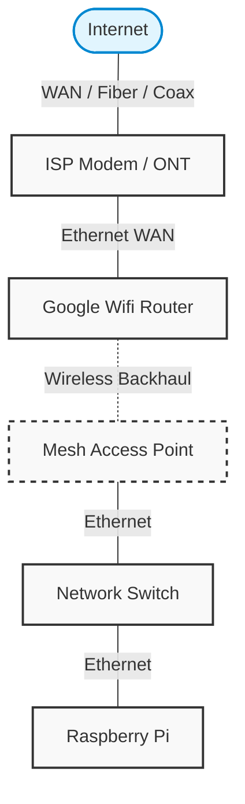
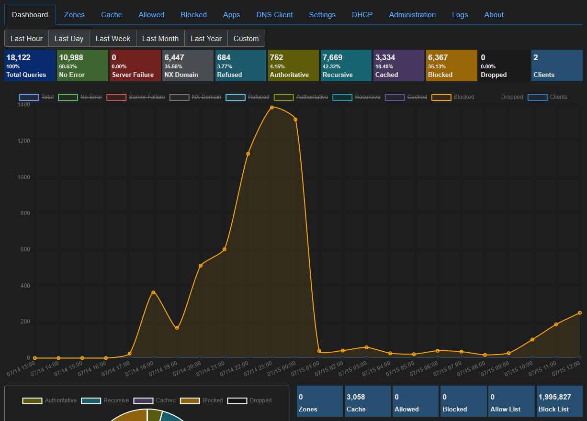

# DNS Sinkhole on Raspberry Pi 5 (Technitium DNS)

Network-wide ad, tracker, and malware blocking on a Raspberry Pi 5 running Technitium DNS Server. Every device on the network is covered automatically, with no client software, and upstream DNS leaves the network encrypted.

## Overview

The Pi acts as the DNS server for the entire home network. The router forwards every device's DNS queries to it. Technitium answers queries for known ad, tracker, and malware domains with NXDOMAIN, so blocked domains simply appear not to exist, and resolves legitimate queries through encrypted upstream resolvers (DNS-over-HTTPS). Block lists refresh automatically on a schedule.

## Hardware & Software

- Raspberry Pi 5 with microSD storage, connected over Ethernet
- Google Wifi mesh (router downstairs, wired access point upstairs)
- Unmanaged Ethernet switch
- Windows 11 PC for imaging and SSH administration
- Raspberry Pi OS Lite (64-bit)
- Raspberry Pi Imager
- Technitium DNS Server

## Network Layout



## Setup

IP addresses in this document (192.168.1.x) are examples, not my real addresses.

### 1. Flash Raspberry Pi OS Lite

I used Raspberry Pi Imager on my Windows desktop. Device: Raspberry Pi 5. Operating system: **Raspberry Pi OS (other) > Raspberry Pi OS Lite (64-bit)**, since a headless server has no need for a desktop environment. Storage: the microSD card.


### 2. Preconfigure the OS in Imager

When Imager offered to apply OS customisation settings, I set a hostname, a username and strong password, and my locale, and enabled SSH with password authentication on the Services tab. This makes the Pi reachable over the network from first boot, no monitor or keyboard required.


### 3. First boot and SSH in

I connected the Pi to the switch over Ethernet and powered it on. After about a minute, I connected from Windows Terminal and installed all available updates:

```
ssh <username>@<pi-ip-address>
sudo apt update && sudo apt full-upgrade -y
```


### 4. Reserve a static IP

A DNS server needs a fixed address. I reserved the Pi's IP in the router's DHCP settings rather than configuring a static address on the Pi itself, since a reservation survives OS reinstalls. I found the Pi's MAC address with `ip link`, created the reservation in the Google Home app, then rebooted with `sudo reboot` and confirmed the Pi came back up on the reserved address.


### 5. Install Technitium DNS

I ran the official installer, which sets up the .NET runtime and Technitium as a systemd service:

```
curl -sSL https://download.technitium.com/dns/install.sh | sudo bash
```

When it finished, I opened the web console from my desktop at `http://<pi-ip-address>:5380` and created the admin account.


### 6. Configure block lists

In **Settings > Blocking** I added the block list URLs (full list below) and set the auto-update interval so the lists refresh on their own.


### 7. Set encrypted upstream resolvers

Under **Settings > Proxy & Forwarders** I set the forwarder protocol to HTTPS and added Quad9 and Cloudflare as upstreams. Queries the Pi can't answer from cache leave the network as DNS-over-HTTPS instead of plaintext port 53 traffic.


### 8. Point the network at the Pi

Google Wifi doesn't allow changing the DNS server it hands out over DHCP; clients always receive the router's own address. Instead, under **Network settings > Advanced networking > DNS > Custom**, I pointed the router's DNS at the Pi, so the router forwards every device's queries to Technitium. I left the secondary DNS field empty: a public fallback would let queries silently bypass the sinkhole whenever the Pi was slow to answer, at the cost of making the Pi a single point of failure for the network's name resolution. One tradeoff of this forwarding approach is that queries arrive at the Pi sourced from the router, so the dashboard has limited per-device visibility.

## Results

After the first full day, the dashboard showed 18,122 total queries with roughly 35% blocked, drawing on just under 2 million domains loaded across the block lists. The Blocked count tracks the NXDOMAIN count almost exactly, which is expected with the blocking type set to NX Domain.



## Block Lists and Allow Lists

All lists come from the [Hagezi DNS Blocklists](https://github.com/hagezi/dns-blocklists) and [NRD](https://github.com/xRuffKez/NRD) projects.

**Block lists**

- **Hagezi Multi Pro**: the main ad, tracker, and telemetry list
  `https://raw.githubusercontent.com/hagezi/dns-blocklists/main/wildcard/pro-onlydomains.txt`
- **Hagezi Threat Intelligence Feeds**: malware, phishing, and scam domains
  `https://raw.githubusercontent.com/hagezi/dns-blocklists/main/wildcard/tif-onlydomains.txt`
- **Hagezi Dynamic DNS**: dynamic DNS providers frequently abused for phishing
  `https://raw.githubusercontent.com/hagezi/dns-blocklists/main/wildcard/dyndns-onlydomains.txt`
- **Hagezi Badware Hoster**: hosting services frequently abused to serve malware
  `https://raw.githubusercontent.com/hagezi/dns-blocklists/main/wildcard/hoster-onlydomains.txt`
- **Hagezi Spam TLDs (aggressive)**: blocks entire top-level domains with high abuse rates
  `https://raw.githubusercontent.com/hagezi/dns-blocklists/main/adblock/spam-tlds-adblock-aggressive.txt`
- **NRD 30-day, parts 1 and 2**: domains registered within the last 30 days, a common marker of phishing and scam infrastructure
  `https://raw.githubusercontent.com/xRuffKez/NRD/main/lists/30-day/domains-only/nrd-30day_part1.txt`
  `https://raw.githubusercontent.com/xRuffKez/NRD/main/lists/30-day/domains-only/nrd-30day_part2.txt`

**Allow list**

- **Hagezi Spam TLDs allow list**: companion list that restores legitimate domains on otherwise-blocked TLDs
  `https://raw.githubusercontent.com/hagezi/dns-blocklists/main/adblock/spam-tlds-adblock-allow.txt`

## Problems I Ran Into

### Installed the wrong OS image

**Problem:** I flashed the full desktop version of Raspberry Pi OS when I only needed a headless server, so I had to reflash.

**Solution:** In Raspberry Pi Imager, the Lite version is hidden under **Raspberry Pi OS (other)**. That submenu has Raspberry Pi OS Lite (64-bit).

### Pi didn't appear in the Google Home device list

**Problem:** After first boot, the Pi never showed up in the Google Wifi app's device list, so I had no IP address to SSH to.

**Solution:** Power cycled the Pi (unplugged for 10 seconds) so it would request a fresh DHCP lease, and restarted the network from the Google Home app. The Pi appeared once everything came back up. I then reserved its IP in DHCP so the address survives future reboots.

### Query Logs page wouldn't open

**Problem:** I couldn't open the query logs in the Technitium dashboard to verify my settings were working.

**Solution:** Query logging is an add-on, not a built-in feature. Installing the **Query Logs (Sqlite)** app from the Apps section of the dashboard enabled it.

### My own router was being refused DNS service

**Problem:** The dashboard showed an unknown public IP being refused on every query. It turned out to be my own router. Its system queries arrive sourced from the WAN interface address, which my recursion policy treated as an external client.

**Solution:** Set **Settings > Recursion** to "Allow Recursion Only For Specified Networks" and listed `192.168.1.0/24` (my LAN), `127.0.0.0/8` (the Pi itself), and the router's WAN address as a `/32`. This is safe only because it is my own static IP. Outside packets can't reach the Pi claiming that source, since the router doesn't forward port 53 inbound. If my ISP ever changes the address, this entry needs updating.

## What I'd Do Differently

Install Docker first and run Technitium in a container. Bare metal works fine and is what I have now, but I plan to run more services on this Pi over time, and containers keep each service isolated and easy to upgrade or roll back without disturbing the rest of the system.
